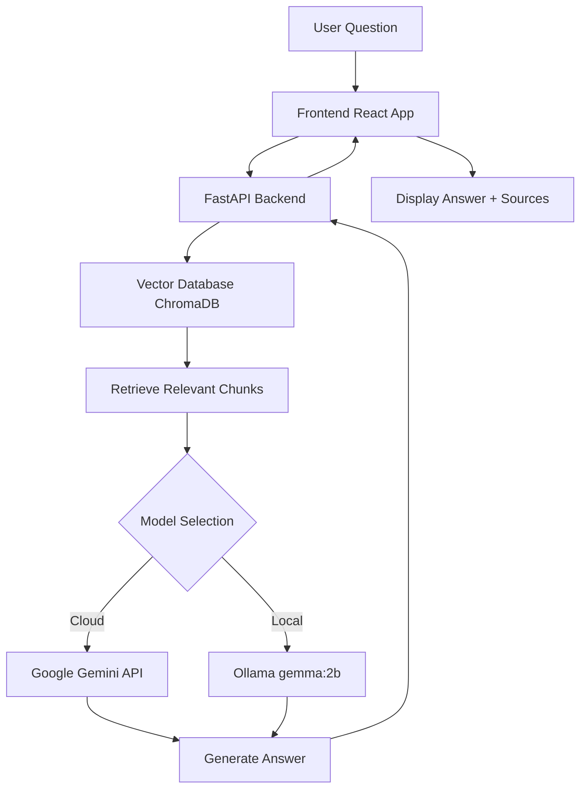

# Building a RAG System from Scratch: Complete Guide

## Table of Contents
1. [Introduction](#introduction)
2. [What is RAG?](#what-is-rag)
3. [Architecture Overview](#architecture-overview)
4. [Prerequisites](#prerequisites)
5. [Technology Stack Explained](#technology-stack-explained)
6. [Step-by-Step Implementation](#step-by-step-implementation)
7. [Testing and Verification](#testing-and-verification)
8. [Troubleshooting](#troubleshooting)
9. [Further Learning](#further-learning)

---

## Introduction

This guide will teach you how to build **SmartDocs**, a Retrieval-Augmented Generation (RAG) system that allows users to ask questions about technical documentation using natural language. By the end, you'll have a working application with:
- A Python backend that processes documents and answers questions
- A React frontend for user interaction
- Support for both cloud (Google Gemini) and local (Ollama) AI models

---

## What is RAG?

### The Problem
Large Language Models (LLMs) like ChatGPT have two major limitations:
1. **Hallucinations**: They sometimes make up information that sounds plausible but is false
2. **Knowledge Cutoff**: They don't know about your private documents or recent information

### The Solution: RAG
**Retrieval-Augmented Generation** solves this by:
1. **Storing** your documents in a searchable database
2. **Retrieving** relevant sections when a user asks a question
3. **Augmenting** the LLM's prompt with this retrieved context
4. **Generating** an answer based *only* on the provided context

**Example:**
- **Without RAG**: "What is OmegaCore?" → LLM guesses or says "I don't know"
- **With RAG**: System finds relevant docs → Sends them to LLM → LLM answers accurately

---

## Architecture Overview



### Components:
1. **Frontend (React)**: User interface for asking questions
2. **Backend (FastAPI)**: Orchestrates the RAG pipeline
3. **Vector Database (ChromaDB)**: Stores document embeddings
4. **LLM (Gemini/Ollama)**: Generates natural language answers
5. **Embedding Model (sentence-transformers)**: Converts text to vectors

---

## Prerequisites

### System Requirements
- **OS**: Linux (Ubuntu 20.04+), macOS, or Windows with WSL
- **Python**: 3.9 or higher
- **Node.js**: 18 or higher
- **RAM**: Minimum 8GB (16GB recommended)
- **Disk Space**: ~5GB for dependencies

### Required Accounts
- **Google AI Studio Account** (free): For Gemini API key
  - Go to [https://aistudio.google.com/](https://aistudio.google.com/)
  - Click "Get API key"
  - Create a new project and copy the key

### Optional (for Local Mode)
- **Ollama**: For running local models
  - Download from [https://ollama.com](https://ollama.com)

---

## Technology Stack Explained

### Backend Technologies

#### 1. **Python**
- **What**: Programming language
- **Why**: Excellent ecosystem for AI/ML tasks
- **Reference**: [python.org](https://www.python.org/)

#### 2. **FastAPI**
- **What**: Modern web framework for building APIs
- **Why**: Fast, automatic API documentation, async support
- **Key Concept**: Creates HTTP endpoints that the frontend calls
- **Reference**: [fastapi.tiangolo.com](https://fastapi.tiangolo.com/)

#### 3. **LangChain**
- **What**: Framework for building LLM applications
- **Why**: Simplifies RAG pipeline (loading docs, splitting, chaining)
- **Key Modules**:
  - `langchain-community`: Document loaders
  - `langchain-core`: Core abstractions
  - `langchain-google-genai`: Gemini integration
- **Reference**: [python.langchain.com](https://python.langchain.com/)

#### 4. **ChromaDB**
- **What**: Open-source vector database
- **Why**: Stores and searches document embeddings efficiently
- **Key Concept**: Unlike SQL databases that search exact text, vector DBs find *semantically similar* content
- **Reference**: [docs.trychroma.com](https://docs.trychroma.com/)

#### 5. **Sentence Transformers**
- **What**: Library for creating text embeddings
- **Why**: Converts sentences to 384-dimensional vectors
- **Model Used**: `all-MiniLM-L6-v2` (fast, lightweight)
- **Reference**: [sbert.net](https://www.sbert.net/)

#### 6. **Google Generative AI**
- **What**: Google's LLM API (Gemini models)
- **Why**: High-quality, fast, free tier available
- **Reference**: [ai.google.dev](https://ai.google.dev/)

#### 7. **Ollama**
- **What**: Tool for running LLMs locally
- **Why**: Privacy, offline use, no API costs
- **Model Used**: `gemma:2b` (Google's open-source 2B parameter model)
- **Reference**: [ollama.com](https://ollama.com/)

### Frontend Technologies

#### 1. **React**
- **What**: JavaScript library for building UIs
- **Why**: Component-based, widely used, fast
- **Reference**: [react.dev](https://react.dev/)

#### 2. **Vite**
- **What**: Build tool and dev server
- **Why**: Much faster than traditional tools like Webpack
- **Reference**: [vitejs.dev](https://vitejs.dev/)

### Key Concepts

#### Embeddings
- **What**: Numerical representations of text (vectors)
- **Example**: "cat" → `[0.2, -0.5, 0.8, ...]` (384 numbers)
- **Why**: Computers can't compare text directly, but can measure distance between vectors
- **Similarity**: Similar meanings = similar vectors

#### Vector Search
- **What**: Finding documents with similar embeddings
- **How**: Uses algorithms like HNSW (Hierarchical Navigable Small World)
- **Example**: 
  - Query: "installation error" → `[0.1, 0.3, ...]`
  - Doc 1: "How to install" → `[0.12, 0.29, ...]` ← Close match!
  - Doc 2: "API reference" → `[0.9, -0.5, ...]` ← Far away

#### Chunking
- **What**: Breaking documents into smaller pieces
- **Why**: LLMs have token limits (can't process entire books)
- **Strategy**: Split by paragraphs, with overlap to preserve context
- **Example**: 1000 characters per chunk, 200 character overlap

---

## Step-by-Step Implementation

### Phase 1: Project Setup

#### Step 1.1: Create Directory Structure
```bash
mkdir -p smartdocs/{backend,frontend,data}
cd smartdocs
```

**Explanation**: 
- `mkdir -p`: Creates nested directories
- We separate backend (Python), frontend (React), and data (documents)

#### Step 1.2: Create Sample Documentation
Create 4 markdown files in `data/`:

**File: `data/introduction.md`**
```markdown
# Introduction to OmegaCore

OmegaCore is a quantum-resilient data processing library.

## Key Features
- QuantumGuard™: Quantum-safe encryption
- NanoSync: Real-time synchronization
- EcoMode: Reduces CPU usage by 40%
```

**Why**: We need sample data to test our RAG system. Using fictional "OmegaCore" ensures the LLM can't answer from pre-trained knowledge.

Create similar files for:
- `installation.md`: Installation instructions
- `api_reference.md`: API documentation
- `troubleshooting.md`: Error codes and fixes

---

### Phase 2: Backend Development

#### Step 2.1: Setup Python Environment
```bash
cd backend
python3 -m venv venv
source venv/bin/activate  # On Windows: venv\Scripts\activate
```

**Explanation**:
- `venv`: Virtual environment isolates project dependencies
- `activate`: Switches to this environment

#### Step 2.2: Install Dependencies
Create `requirements.txt`:
```
fastapi
uvicorn
python-dotenv
pydantic
ollama
langchain==0.2.14
langchain-community==0.2.12
langchain-core==0.2.33
langchain-text-splitters==0.2.2
langchain-google-genai==1.0.10
google-generativeai==0.7.2
langchain-huggingface==0.0.3
sentence-transformers==3.0.0
chromadb==0.5.0
langchain-chroma==0.1.2
```

Install:
```bash
pip install -r requirements.txt
```

**Why These Versions**: Pinned versions prevent dependency conflicts (a common Python pain point).

#### Step 2.3: Create Environment File
Create `.env`:
```
GOOGLE_API_KEY=your_api_key_here
```

**Security Note**: Never commit `.env` to Git! Add it to `.gitignore`.

#### Step 2.4: Build the Ingestion Script
Create `ingest.py`:

```python
import os
from langchain_community.document_loaders import DirectoryLoader, TextLoader
from langchain_text_splitters import RecursiveCharacterTextSplitter
from langchain_huggingface import HuggingFaceEmbeddings
from langchain_chroma import Chroma

# Paths
DATA_PATH = "../data"
DB_PATH = "./chroma_db"

def create_vector_db():
    # Step 1: Load all .md files from data directory
    loader = DirectoryLoader(DATA_PATH, glob="*.md", loader_cls=TextLoader)
    documents = loader.load()
    print(f"Loaded {len(documents)} documents.")

    # Step 2: Split documents into chunks
    text_splitter = RecursiveCharacterTextSplitter(
        chunk_size=1000,        # Max characters per chunk
        chunk_overlap=200,      # Overlap to preserve context
        separators=["\n\n", "\n", " ", ""]  # Split on paragraphs first
    )
    chunks = text_splitter.split_documents(documents)
    print(f"Split into {len(chunks)} chunks.")

    # Step 3: Create embeddings using local model
    embeddings = HuggingFaceEmbeddings(
        model_name="sentence-transformers/all-MiniLM-L6-v2"
    )

    # Step 4: Store in ChromaDB
    if os.path.exists(DB_PATH):
        import shutil
        shutil.rmtree(DB_PATH)  # Clear old data
    
    Chroma.from_documents(
        documents=chunks,
        embedding=embeddings,
        persist_directory=DB_PATH
    )
    print("Success! Vector database created.")

if __name__ == "__main__":
    create_vector_db()
```

**Detailed Explanation**:

1. **DirectoryLoader**: Reads all markdown files
2. **RecursiveCharacterTextSplitter**: 
   - Tries to split on `\n\n` (paragraphs) first
   - Falls back to `\n` (lines), then spaces
   - Ensures chunks aren't too big for the LLM
3. **HuggingFaceEmbeddings**: 
   - Downloads `all-MiniLM-L6-v2` model (~90MB)
   - Converts each chunk to a 384-dimensional vector
4. **Chroma.from_documents**: 
   - Stores vectors in `./chroma_db/` directory
   - Creates an index for fast similarity search

Run it:
```bash
python ingest.py
```

**Expected Output**:
```
Loaded 4 documents.
Split into 13 chunks.
Creating embeddings...
Success! Vector database created.
```

#### Step 2.5: Build the API Server
Create `main.py`:

```python
import os
from fastapi import FastAPI, HTTPException
from fastapi.middleware.cors import CORSMiddleware
from pydantic import BaseModel
from dotenv import load_dotenv
from langchain_google_genai import ChatGoogleGenerativeAI
from langchain_community.chat_models import ChatOllama
from langchain_huggingface import HuggingFaceEmbeddings
from langchain_chroma import Chroma
from langchain_core.prompts import ChatPromptTemplate
from langchain_core.runnables import RunnablePassthrough
from langchain_core.output_parsers import StrOutputParser

load_dotenv()

app = FastAPI(title="SmartDocs RAG API")

# Enable CORS (allows frontend to call backend)
app.add_middleware(
    CORSMiddleware,
    allow_origins=["*"],
    allow_credentials=True,
    allow_methods=["*"],
    allow_headers=["*"],
)

# Initialize Vector DB
DB_PATH = "./chroma_db"
embeddings = HuggingFaceEmbeddings(
    model_name="sentence-transformers/all-MiniLM-L6-v2"
)
vector_db = Chroma(persist_directory=DB_PATH, embedding_function=embeddings)
retriever = vector_db.as_retriever(search_kwargs={"k": 3})  # Retrieve top 3 chunks

# Request Model
class ChatRequest(BaseModel):
    question: str
    model_type: str = "gemini"  # "gemini" or "local"

# Prompt Template
template = """Answer the question based ONLY on the following context:
{context}

Question: {question}

If the context doesn't contain the answer, say "I don't have information about that in the documentation."
"""
prompt = ChatPromptTemplate.from_template(template)

def get_llm(model_type: str):
    """Returns the appropriate LLM based on user selection"""
    if model_type == "gemini":
        api_key = os.getenv("GOOGLE_API_KEY")
        if not api_key:
            raise HTTPException(status_code=500, detail="GOOGLE_API_KEY not found")
        return ChatGoogleGenerativeAI(model="gemini-2.5-flash", google_api_key=api_key)
    elif model_type == "local":
        return ChatOllama(model="gemma:2b")
    else:
        raise HTTPException(status_code=400, detail="Invalid model_type")

def format_docs(docs):
    """Combines retrieved documents into a single string"""
    return "\n\n".join([d.page_content for d in docs])

@app.post("/chat")
async def chat(request: ChatRequest):
    try:
        llm = get_llm(request.model_type)
        
        # Build RAG Chain
        chain = (
            {"context": retriever | format_docs, "question": RunnablePassthrough()}
            | prompt
            | llm
            | StrOutputParser()
        )
        
        # Execute
        response = chain.invoke(request.question)
        
        # Get source documents
        source_docs = retriever.get_relevant_documents(request.question)
        sources = list(set([doc.metadata.get("source", "unknown") for doc in source_docs]))
        
        return {
            "answer": response,
            "sources": sources
        }
    except Exception as e:
        raise HTTPException(status_code=500, detail=str(e))

@app.get("/health")
async def health():
    return {"status": "ok"}
```

**Detailed Explanation**:

1. **CORS Middleware**: Allows frontend (port 5173) to call backend (port 8000)
2. **Retriever**: Configured to return top 3 most similar chunks
3. **RAG Chain** (the magic!):
   ```python
   {
       "context": retriever | format_docs,  # Get relevant docs
       "question": RunnablePassthrough()     # Pass question through
   }
   | prompt      # Insert into template
   | llm         # Send to LLM
   | StrOutputParser()  # Extract text response
   ```
4. **LangChain Expression Language (LCEL)**: The `|` operator chains operations

Run the server:
```bash
uvicorn main:app --reload --port 8000
```

**Test it**:
```bash
curl -X POST http://localhost:8000/chat \
  -H "Content-Type: application/json" \
  -d '{"question": "What is OmegaCore?", "model_type": "gemini"}'
```

---

### Phase 3: Frontend Development

#### Step 3.1: Create React App
```bash
cd ../frontend
npx create-vite@latest . --template react
npm install
```

**Explanation**:
- `create-vite`: Scaffolds a React project
- `--template react`: Uses React template (vs Vue, Svelte, etc.)

#### Step 3.2: Build the UI
Replace `src/App.jsx`:

```jsx
import { useState, useRef, useEffect } from 'react'
import './App.css'

function App() {
  const [messages, setMessages] = useState([
    { text: "Hello! I'm SmartDocs. Ask me anything about OmegaCore.", sender: "bot" }
  ])
  const [input, setInput] = useState("")
  const [model, setModel] = useState("gemini")
  const [loading, setLoading] = useState(false)
  const messagesEndRef = useRef(null)

  const scrollToBottom = () => {
    messagesEndRef.current?.scrollIntoView({ behavior: "smooth" })
  }

  useEffect(scrollToBottom, [messages])

  const sendMessage = async () => {
    if (!input.trim()) return

    const userMessage = { text: input, sender: "user" }
    setMessages(prev => [...prev, userMessage])
    setInput("")
    setLoading(true)

    try {
      const response = await fetch("http://localhost:8000/chat", {
        method: "POST",
        headers: { "Content-Type": "application/json" },
        body: JSON.stringify({ question: userMessage.text, model_type: model })
      })

      const data = await response.json()
      
      if (response.ok) {
        setMessages(prev => [...prev, { 
          text: data.answer, 
          sender: "bot", 
          sources: data.sources 
        }])
      } else {
        setMessages(prev => [...prev, { text: "Error: " + data.detail, sender: "bot" }])
      }
    } catch (error) {
      setMessages(prev => [...prev, { text: "Error: Could not connect to server.", sender: "bot" }])
    } finally {
      setLoading(false)
    }
  }

  return (
    <div className="app-container">
      <header className="header">
        <h1>📚 SmartDocs <span className="subtitle">OmegaCore Assistant</span></h1>
        <div className="model-selector">
          <label>Model:</label>
          <select value={model} onChange={(e) => setModel(e.target.value)}>
            <option value="gemini">Google Gemini (Cloud)</option>
            <option value="local">Ollama (Local)</option>
          </select>
        </div>
      </header>

      <div className="chat-window">
        {messages.map((msg, index) => (
          <div key={index} className={`message ${msg.sender}`}>
            <div className="message-content">
              {msg.text}
              {msg.sources && msg.sources.length > 0 && (
                <div className="sources">
                  <small>Sources: {msg.sources.join(", ")}</small>
                </div>
              )}
            </div>
          </div>
        ))}
        {loading && <div className="message bot"><div className="message-content typing">Thinking...</div></div>}
        <div ref={messagesEndRef} />
      </div>

      <div className="input-area">
        <input 
          type="text" 
          value={input} 
          onChange={(e) => setInput(e.target.value)} 
          onKeyPress={(e) => e.key === 'Enter' && sendMessage()}
          placeholder="Ask a question about OmegaCore..."
          disabled={loading}
        />
        <button onClick={sendMessage} disabled={loading}>Send</button>
      </div>
    </div>
  )
}

export default App
```

**Key React Concepts**:
- **useState**: Manages component state (messages, input, etc.)
- **useEffect**: Runs side effects (auto-scroll when messages change)
- **useRef**: Direct DOM access (for scrolling)
- **async/await**: Handles asynchronous API calls

#### Step 3.3: Style the UI
Replace `src/App.css`:

```css
:root {
  --primary-color: #646cff;
  --bg-color: #1a1a1a;
  --text-color: rgba(255, 255, 255, 0.87);
}

body {
  margin: 0;
  background-color: var(--bg-color);
  color: var(--text-color);
  font-family: Inter, system-ui, sans-serif;
}

.app-container {
  display: flex;
  flex-direction: column;
  height: 100vh;
  max-width: 800px;
  margin: 0 auto;
  padding: 0 20px;
}

.header {
  display: flex;
  justify-content: space-between;
  align-items: center;
  padding: 20px 0;
  border-bottom: 1px solid #333;
}

.chat-window {
  flex: 1;
  overflow-y: auto;
  padding: 20px 0;
  display: flex;
  flex-direction: column;
  gap: 15px;
}

.message {
  display: flex;
  flex-direction: column;
  max-width: 80%;
}

.message.user {
  align-self: flex-end;
}

.message.bot {
  align-self: flex-start;
}

.message-content {
  padding: 12px 16px;
  border-radius: 12px;
  line-height: 1.5;
}

.message.user .message-content {
  background-color: var(--primary-color);
  color: white;
}

.message.bot .message-content {
  background-color: #2a2a2a;
}

.sources {
  margin-top: 8px;
  padding-top: 8px;
  border-top: 1px solid rgba(255,255,255,0.1);
  color: #888;
  font-size: 0.8em;
}

.input-area {
  display: flex;
  gap: 10px;
  padding: 20px 0;
}

input {
  flex: 1;
  padding: 12px;
  border-radius: 8px;
  border: 1px solid #444;
  background: #2a2a2a;
  color: white;
  font-size: 16px;
}

button {
  padding: 0 20px;
  border-radius: 8px;
  border: none;
  background-color: var(--primary-color);
  color: white;
  font-weight: bold;
  cursor: pointer;
}

button:disabled {
  opacity: 0.5;
  cursor: not-allowed;
}
```

#### Step 3.4: Run the Frontend
```bash
npm run dev
```

Open [http://localhost:5173](http://localhost:5173)

---

### Phase 4: Optional - Local Model Setup

#### Step 4.1: Install Ollama
Download from [ollama.com](https://ollama.com) and install.

#### Step 4.2: Pull the Model
```bash
ollama pull gemma:2b
```

**Explanation**:
- `gemma:2b`: Google's 2 billion parameter model
- Downloads ~1.4GB
- Runs on CPU (no GPU required)

#### Step 4.3: Test Ollama
```bash
ollama run gemma:2b
```

Type a message to verify it works, then exit with `/bye`.

---

## Testing and Verification

### Test 1: Basic Question
**Question**: "What is OmegaCore?"

**Expected**: Should mention quantum-resilient data processing, cite `introduction.md`

### Test 2: Specific Detail
**Question**: "What is error code 501?"

**Expected**: Should explain ERR_QUANTUM_DECOHERENCE, cite `troubleshooting.md`

### Test 3: Unknown Information
**Question**: "What is Python?"

**Expected**: "I don't have information about that in the documentation."

### Test 4: Model Switching
Switch between Gemini and Ollama mid-conversation. Both should work.

---

## Troubleshooting

### Issue: "ModuleNotFoundError"
**Cause**: Dependency not installed or wrong Python environment

**Fix**:
```bash
source venv/bin/activate  # Ensure venv is active
pip install -r requirements.txt
```

### Issue: "CORS Error" in Browser
**Cause**: Backend not allowing frontend requests

**Fix**: Ensure `CORSMiddleware` is in `main.py`

### Issue: "404 models/gemini-X not found"
**Cause**: Model name changed or API key invalid

**Fix**: Run `verify_api_key.py` to see available models

### Issue: Ollama Connection Failed
**Cause**: Ollama not running

**Fix**:
```bash
ollama serve  # Start Ollama server
```

---

## Further Learning

### Books
- **"Designing Data-Intensive Applications"** by Martin Kleppmann
  - Deep dive into databases and distributed systems
- **"Hands-On Large Language Models"** by Jay Alammar
  - Practical LLM applications

### Courses
- **DeepLearning.AI - LangChain for LLM Application Development**
  - Free course on building with LangChain
- **Fast.ai - Practical Deep Learning**
  - Foundational ML concepts

### Documentation
- [LangChain Docs](https://python.langchain.com/)
- [ChromaDB Docs](https://docs.trychroma.com/)
- [FastAPI Tutorial](https://fastapi.tiangolo.com/tutorial/)
- [React Docs](https://react.dev/learn)

### Advanced Topics to Explore
1. **Hybrid Search**: Combine vector search with keyword search
2. **Re-ranking**: Use a second model to re-order retrieved chunks
3. **Streaming Responses**: Show LLM output word-by-word
4. **Multi-modal RAG**: Include images in your knowledge base
5. **Agent Systems**: Let the LLM decide when to search vs when to answer directly

---

## Conclusion

You've built a production-ready RAG system! Key takeaways:

1. **RAG = Retrieval + Generation**: Always ground LLM responses in your data
2. **Embeddings**: The secret sauce for semantic search
3. **Chunking**: Critical for managing long documents
4. **Dual Backends**: Cloud for speed, local for privacy

**Next Steps**:
- Add more documents to your knowledge base
- Experiment with different chunk sizes
- Try other embedding models (e.g., `bge-large`)
- Deploy to production (Docker + cloud hosting)

Happy building! 🚀
